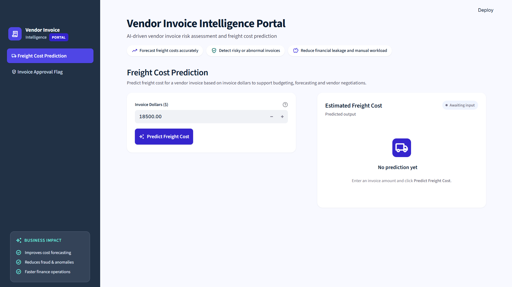
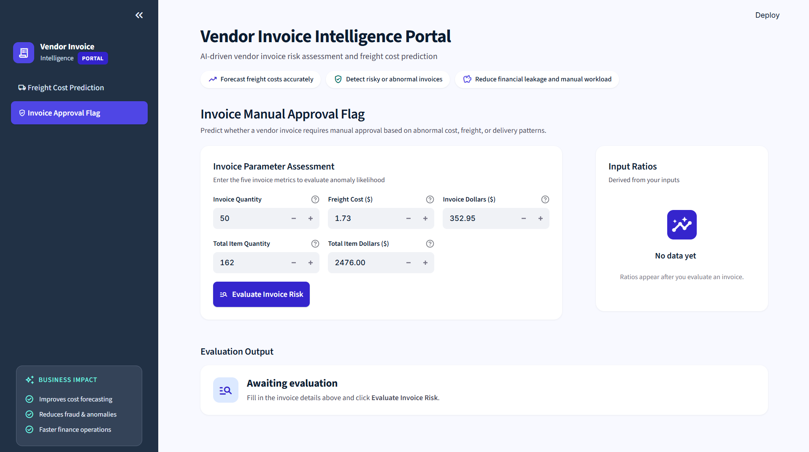
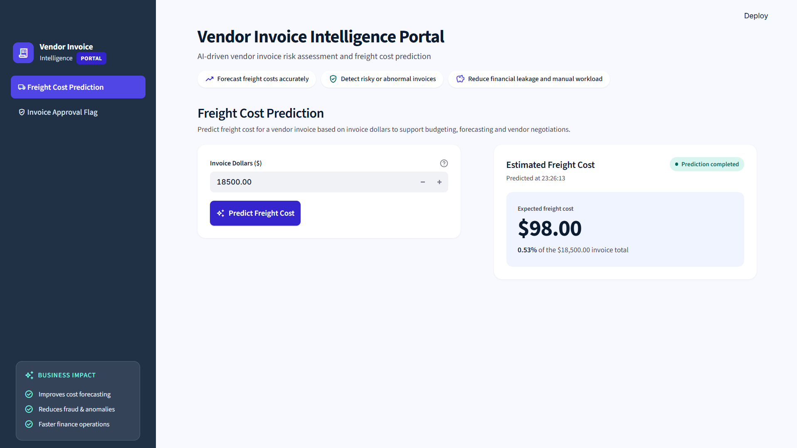
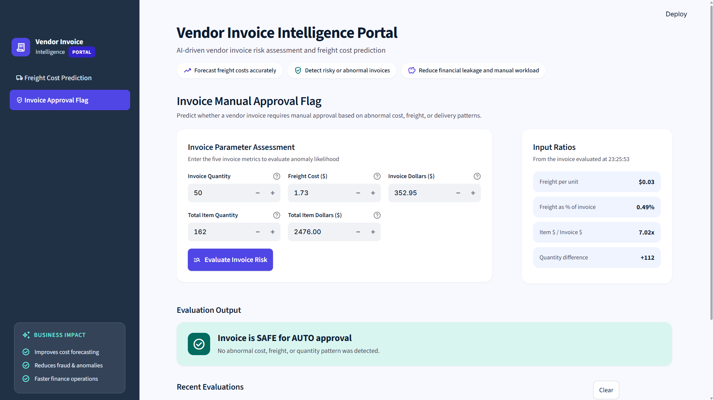
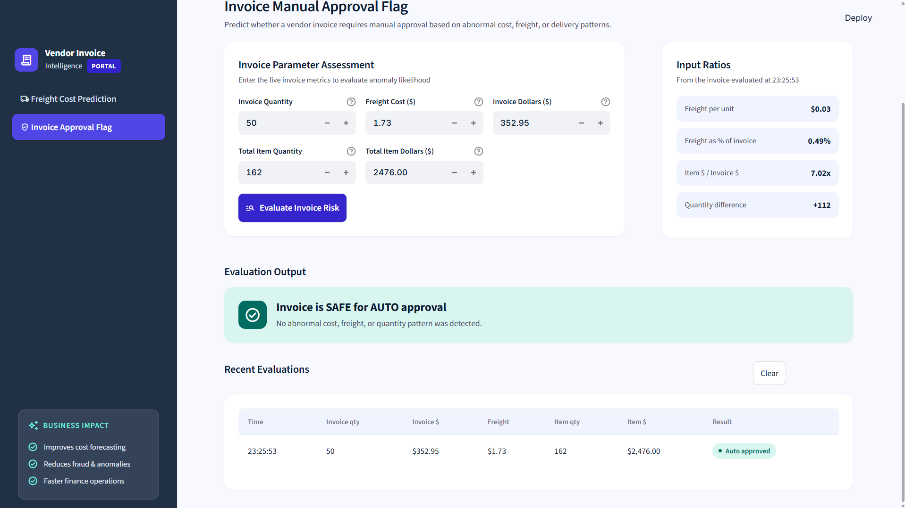

# Vendor Invoice Intelligence System
**Freight Cost Prediction & Invoice Risk Flagging**

## 🚀 Live Demo

**👉 [Try the Vendor Invoice Intelligence Portal live](https://invoice-intelligence-syst.streamlit.app/) 👈**

Here is a quick look at the Vendor Invoice Intelligence Portal:








## Table of Contents
* [Project Overview](#project-overview)
* [Business Objectives](#business-objectives)
* [Data Sources](#data-sources)
* [Models Used](#models-used)
* [Application](#application)
* [Project Structure](#project-structure)


---

## Project Overview

This project implements an **end-to-end machine learning system** designed to support finance teams by:

1. **Freight cost prediction** to support budgeting, forecasting, and vendor negotiations.
2. **Invoice risk flagging** to catch abnormal invoices early and reduce financial leakage.

---

## Business Objectives

- **Better cost forecasting**: Predict freight costs in advance so finance teams can budget accurately and negotiate with vendors using data.
- **Fewer invoice errors and fraud cases**: Detect unusual vendor invoices early and send them for manual review before payment.
- **Faster finance operations**: Automatically approve routine, low-risk invoices so staff can focus on the ones that need attention.
- **Reduced financial leakage**: Prevent overpayments, duplicate charges, and inflated freight costs from slipping through, so money is not lost on incorrect invoices.

---

## Data Sources

The project pulls its data from an internal SQLite database, `inventory.db`, and from CSV snapshots stored in the `data/` directory. The tables include invoice details, purchase quantities, item dollar values, and historical freight costs.

---

## Models Used

1. **Freight Cost Prediction**
   - A **Linear Regression** model that estimates the expected freight cost of a vendor invoice from its invoice dollar value.
   - Gives finance teams a simple, transparent estimate they can use for budgeting, forecasting, and vendor negotiations.

2. **Invoice Manual Approval Flagging**
   - A **Random Forest Classifier**, tuned with cross-validated grid search, that decides whether an invoice is safe to auto-approve or needs manual review.
   - Learns from invoice quantities, dollar values, and freight charges to spot mismatches between expected item costs and what the vendor billed.
   - Includes data cleaning and scaling steps, so results stay reliable even when some inputs are missing or vary widely in size.

---

## Application
We built an interactive, simple-to-use application with `Streamlit`. The platform features dynamic native CSS, clean inputs, loading animations and status indicator cards designed specially for enterprise users and analysts without coding backgrounds. 

---

## Project Structure

```
vendor-invoice-intelligence/
│
├── Data/
│   └── inventory.db
│
├── freight_cost_prediction/
│   ├── data_preprocessing.py
│   ├── train.py
│   └── model_evaluation.py
│
├── invoice_flagging/
│   ├── data_preprocessing.py
│   ├── train.py
│   └── modeling_evaluation.py
│
├── inference/
│   ├── prediction_freight.py
│   └── predict_invice_flag.py
│
├── models/
│   ├── predict_freight_model.pkl
│   ├── random_forest_model.pkl
│   └── scaler.pkl
│
├── notebooks/
│   ├── Predicting Freight Cost.ipynb
│   ├── Invoice_flagging.ipynb
│   └── sample.ipynb
│
├── images                            # Screenshots used in this README
│   
│   
│
├── app.py
├── requirements.txt                  # Python dependencies
└── README.md
```

---

